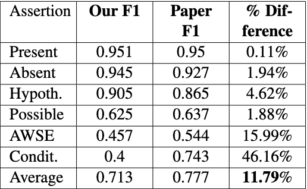

# DLH Final Project Team 82 - ssm5@illinois.edu, ageubell@illinois.edu

### Citation to the original paper
[Attention-Based Bidirectional Long Short-Term Memory Networks for Relation Classification](https://aclanthology.org/P16-2034) (Zhou et al., ACL 2016)

> Peng Zhou, Wei Shi, Jun Tian, Zhenyu Qi, Bingchen Li, Hongwei Hao, and Bo Xu. 2016. Attention-Based Bidirectional Long Short-Term Memory Networks for Relation Classification. In Proceedings of the 54th Annual Meeting of the Association for Computational Linguistics (Volume 2: Short Papers), pages 207–212, Berlin, Germany. Association for Computational Linguistics.

### Link to the code repository
We used an open-source implementation of the aforemnetioned paper that can be found at this [link](https://github.com/zhijing-jin/pytorch_RelationExtraction_AttentionBiLSTM). 

The original README for this repository can be found at the end of this file.


### Dependencies
1. Create a python virtual environment in this directory
2. Install dependencies using:
```
pip3 install -r requirements.txt
```

### Data download instruction
This repository includes the data used in our experiment in the `concept_assertion_relation_training_data` folder.  

The data can also be obtained from the Harvard Department of Medical Informatics [n2c2 research portal](https://portal.dbmi.hms.harvard.edu/projects/n2c2-nlp/).

### Preprocessing code + command
The pre-processing code lives in the `data_formatting.py` file. To pre-process out data, run:
```
python3 data_formatting.py
```

### Training code + Evaluation code command
Our training and evaluation code lives in the `train.py` file. The hyperparameters associated with the training can be modified in the `get_args.py` file.
By default, our training model runs for 25 epochs and print the following statistics in the console:

* Loss
* Accuracy
* F-1 scores for each label
* Recall scores for each label
* Precision scores for each label

Training can be run using the following command:
```
python3 train.py
```

###  Table of results
We used a 70-30 split on our dataset for our train-test split. We used a random word embedding for our sentences and used the following hyperparameters:
* `embedding dimension` - 100
* `LSTM combine` - 'add'
* `embbeding dropout` - 0.5

We achieved the following results:



----

##  [Original GitHub README] 

### (Pytorch) Attention-Based Bidirectional Long Short-Term Memory Networks for Relation Classification
Pytorch implementation of ACL 2016 paper, [Attention-Based Bidirectional Long Short-Term Memory Networks for Relation Classification](http://www.aclweb.org/anthology/P16-2034) (Zhou et al., 2016)

- **Dataset:** Relation Extraction Challenge([**SemEval-2010 Task #8**: *Multi-Way Classification of Semantic Relations Between Pairs of Nominals*](https://docs.google.com/document/d/1QO_CnmvNRnYwNWu1-QCAeR5ToQYkXUqFeAJbdEhsq7w/preview))
- **Performance**: This code repo approached 71% F1. **Please feel free to fork and refine it and get the paper's reported 84%.**
- **Model Structure:** Attention-based BiLSTM

<p align="center">
	
</p>


<!-- ## Quick Start
### Dataloading
```
python data/re_semeval/reader.py
python preprocess.py
```

### Train
```bash
python train.py
```
- 20190909 run: 71.2% on semeval

### Evaluate
```bash
python train.py -load_model 'tmp/model'
```


## Dataset: SemEval-2010 Task #8
* Given: a pair of *nominals*
* Goal: recognize the semantic relation between these nominals.
* Example:
	* "There were apples, **<U>pears</U>** and oranges in the **<U>bowl</U>**." 
		<br> → *CONTENT-CONTAINER(pears, bowl)*
	* “The cup contained **<U>tea</U>** from dried **<U>ginseng</U>**.” 
		<br> → *ENTITY-ORIGIN(tea, ginseng)*


### The Inventory of Semantic Relations
1. *Cause-Effect(CE)*: An event or object leads to an effect(those cancers were caused by radiation exposures)
2. *Instrument-Agency(IA)*: An agent uses an instrument(phone operator)
3. *Product-Producer(PP)*: A producer causes a product to exist (a factory manufactures suits)
4. *Content-Container(CC)*: An object is physically stored in a delineated area of space (a bottle full of honey was weighed) Hendrickx, Kim, Kozareva, Nakov, O S´ eaghdha, Pad ´ o,´ Pennacchiotti, Romano, Szpakowicz Task Overview Data Creation Competition Results and Discussion The Inventory of Semantic Relations (III)
5. *Entity-Origin(EO)*: An entity is coming or is derived from an origin, e.g., position or material (letters from foreign countries)
6. *Entity-Destination(ED)*: An entity is moving towards a destination (the boy went to bed) 
7. *Component-Whole(CW)*: An object is a component of a larger whole (my apartment has a large kitchen)
8. *Member-Collection(MC)*: A member forms a nonfunctional part of a collection (there are many trees in the forest)
9. *Message-Topic(CT)*: An act of communication, written or spoken, is about a topic (the lecture was about semantics)
10. *OTHER*: If none of the above nine relations appears to be suitable.


### Distribution for Dataset
* **SemEval-2010 Task #8 Dataset [[Download](https://drive.google.com/file/d/0B_jQiLugGTAkMDQ5ZjZiMTUtMzQ1Yy00YWNmLWJlZDYtOWY1ZDMwY2U4YjFk/view?layout=list&ddrp=1&sort=name&num=50#)]**

	| Relation           | Train Data          | Test Data           | Total Data           |
	|--------------------|:-------------------:|:-------------------:|:--------------------:|
	| Cause-Effect       | 1,003 (12.54%)      | 328 (12.07%)        | 1331 (12.42%)        |
	| Instrument-Agency  | 504 (6.30%)         | 156 (5.74%)         | 660 (6.16%)          |
	| Product-Producer   | 717 (8.96%)         | 231 (8.50%)         | 948 (8.85%)          |
	| Content-Container  | 540 (6.75%)         | 192 (7.07%)         | 732 (6.83%)          |
	| Entity-Origin      | 716 (8.95%)         | 258 (9.50%)         | 974 (9.09%)          |
	| Entity-Destination | 845 (10.56%)        | 292 (10.75%)        | 1137 (10.61%)        |
	| Component-Whole    | 941 (11.76%)        | 312 (11.48%)        | 1253 (11.69%)        |
	| Member-Collection  | 690 (8.63%)         | 233 (8.58%)         | 923 (8.61%)          |
	| Message-Topic      | 634 (7.92%)         | 261 (9.61%)         | 895 (8.35%)          |
	| Other              | 1,410 (17.63%)      | 454 (16.71%)        | 1864 (17.39%)        |
	| **Total**          | **8,000 (100.00%)** | **2,717 (100.00%)** | **10,717 (100.00%)** |
 -->


## Reference
* [**Attention-Based Bidirectional Long Short-Term Memory Networks for Relation Classification**](http://www.aclweb.org/anthology/P16-2034) (ACL 2016), P Zhou et al.
* SeoSangwoo's [Tensorflow implementation](https://github.com/SeoSangwoo/Attention-Based-BiLSTM-relation-extraction)
